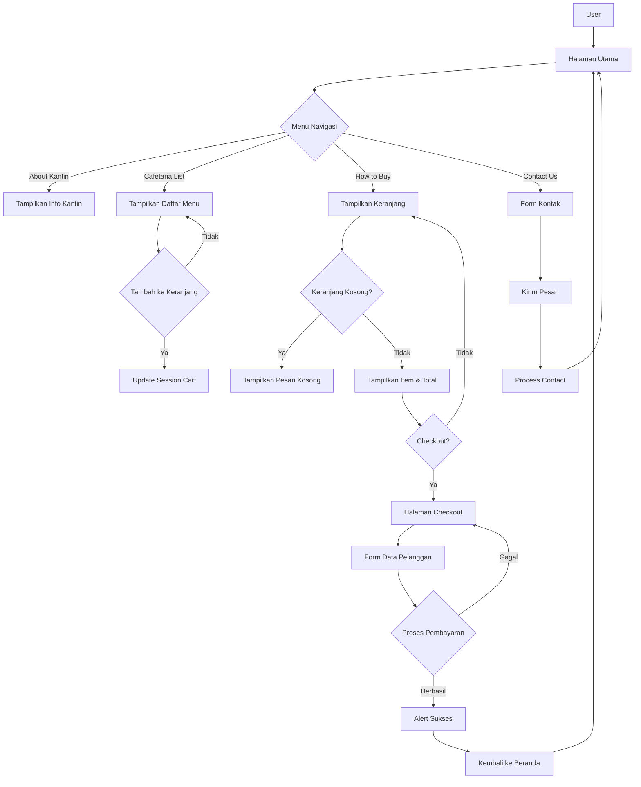

# Aplikasi Pemesanan Makanan Kantin Sekolah

## Deskripsi
Aplikasi ini adalah sistem pemesanan makanan online untuk kantin sekolah yang memungkinkan siswa untuk memesan makanan dan minuman secara digital. Aplikasi ini menggunakan PHP, MySQL, Bootstrap, dan SweetAlert2 untuk memberikan pengalaman pengguna yang baik.

## Flowchart Aplikasi



## Penjelasan Flowchart

1. **Halaman Utama**
   - User masuk ke halaman utama
   - Tersedia 4 menu navigasi: About Kantin, Cafetaria List, How to Buy, Contact Us

2. **Proses Pemesanan**
   - User memilih menu dari Cafetaria List
   - User dapat menambah menu ke keranjang
   - Data keranjang disimpan dalam session

3. **Keranjang Belanja**
   - User dapat melihat isi keranjang di menu How to Buy
   - Jika keranjang kosong, tampilkan pesan
   - Jika ada item, tampilkan daftar item dan total

4. **Proses Checkout**
   - User mengisi data pelanggan
   - Sistem memproses pembayaran
   - Jika berhasil, tampilkan alert sukses
   - Jika gagal, kembali ke form checkout

5. **Notifikasi**
   - Setelah pembayaran berhasil, tampilkan alert
   - User diarahkan kembali ke halaman utama

6. **Form Kontak**
   - User dapat mengirim pesan/kritik
   - Data dikirim ke process_contact.php
   - Setelah berhasil, kembali ke halaman utama

## Struktur Database
Database menggunakan MySQL dengan nama `db_kantin` yang terdiri dari beberapa tabel:

### 1. Tabel `kantin`
- `id` (INT, Primary Key, Auto Increment)
- `nama_kantin` (VARCHAR(100), NOT NULL)
- `foto_kantin` (VARCHAR(255))
- `deskripsi` (TEXT)

### 2. Tabel `menu`
- `id` (INT, Primary Key, Auto Increment)
- `kantin_id` (INT, Foreign Key ke tabel kantin)
- `nama_menu` (VARCHAR(100), NOT NULL)
- `harga` (DECIMAL(10,2), NOT NULL)
- `stok` (INT, NOT NULL, DEFAULT 0)
- `foto_menu` (VARCHAR(255))

### 3. Tabel `pesanan`
- `id` (INT, Primary Key, Auto Increment)
- `nama_pelanggan` (VARCHAR(100), NOT NULL)
- `email` (VARCHAR(100), NOT NULL)
- `total_harga` (DECIMAL(10,2), NOT NULL)
- `tanggal_pesanan` (DATETIME, DEFAULT CURRENT_TIMESTAMP)

### 4. Tabel `detail_pesanan`
- `id` (INT, Primary Key, Auto Increment)
- `pesanan_id` (INT, Foreign Key ke tabel pesanan)
- `menu_id` (INT, Foreign Key ke tabel menu)
- `quantity` (INT, NOT NULL)

## Relasi Database
1. `kantin` 1:N `menu` - Satu kantin dapat memiliki banyak menu
2. `pesanan` 1:N `detail_pesanan` - Satu pesanan dapat memiliki banyak detail pesanan
3. `menu` 1:N `detail_pesanan` - Satu menu dapat muncul di banyak detail pesanan

## Alur Kerja Aplikasi

### 1. Halaman Utama (index.php)
- **Tampilan Awal**:
  - Menampilkan navigasi dengan menu: About Kantin, Cafetaria List, How to Buy, Contact Us
  - Bagian About Kantin menampilkan informasi dan gambar kantin
  - Bagian Cafetaria List menampilkan daftar kantin beserta menu-menu mereka

- **Proses Menambah ke Keranjang**:
  ```php
  if (isset($_POST['add_to_cart'])) {
      $menu_id = $_POST['menu_id'];
      $quantity = $_POST['quantity'];
      
      if (isset($_SESSION['cart'][$menu_id])) {
          $_SESSION['cart'][$menu_id] += $quantity;
      } else {
          $_SESSION['cart'][$menu_id] = $quantity;
      }
  }
  ```
  - Data keranjang disimpan dalam session PHP
  - Jika menu sudah ada di keranjang, quantity akan ditambahkan
  - Jika menu belum ada, akan ditambahkan sebagai item baru

### 2. Proses Checkout (checkout.php)
- **Form Checkout**:
  - User mengisi nama dan email
  - Menampilkan ringkasan pesanan dan total harga
  - Menampilkan QR Code untuk pembayaran

- **Proses Pembayaran**:
  ```php
  if (isset($_POST['checkout'])) {
      // Hitung total
      foreach ($_SESSION['cart'] as $menu_id => $quantity) {
          $query = "SELECT harga FROM menu WHERE id = $menu_id";
          $result = mysqli_query($conn, $query);
          $menu = mysqli_fetch_assoc($result);
          $total += $menu['harga'] * $quantity;
      }
      
      // Simpan pesanan
      $query = "INSERT INTO pesanan (nama_pelanggan, email, total_harga) 
                VALUES ('$nama', '$email', $total)";
      mysqli_query($conn, $query);
      $pesanan_id = mysqli_insert_id($conn);
      
      // Simpan detail pesanan dan update stok
      foreach ($_SESSION['cart'] as $menu_id => $quantity) {
          // Insert detail pesanan
          $query = "INSERT INTO detail_pesanan (pesanan_id, menu_id, quantity) 
                    VALUES ($pesanan_id, $menu_id, $quantity)";
          mysqli_query($conn, $query);
          
          // Update stok
          $query = "UPDATE menu SET stok = stok - $quantity WHERE id = $menu_id";
          mysqli_query($conn, $query);
      }
  }
  ```

- **Notifikasi Sukses**:
  ```javascript
  Swal.fire({
      title: 'Pembayaran Berhasil!',
      text: 'Silahkan tunjukkan QR Code ini ke kasir untuk mengambil pesanan Anda.',
      icon: 'success',
      confirmButtonText: 'OK',
      confirmButtonColor: '#28a745'
  });
  ```

### 3. Fitur Keamanan
1. **Validasi Input**:
   - Form menggunakan atribut `required` untuk memastikan data terisi
   - Validasi email menggunakan type="email"
   - Sanitasi data sebelum disimpan ke database

2. **Manajemen Session**:
   - Pengecekan session untuk keranjang belanja
   - Redirect ke halaman utama jika keranjang kosong

3. **Pengecekan Stok**:
   - Validasi stok sebelum pemesanan
   - Update stok otomatis setelah pembayaran

## Cara Menjalankan Aplikasi

1. **Persiapan Database**:
   ```sql
   CREATE DATABASE db_kantin;
   USE db_kantin;
   ```
   - Import file `database.sql` untuk membuat struktur tabel dan data awal

2. **Konfigurasi**:
   - Sesuaikan pengaturan database di `config.php`:
     ```php
     $host = "localhost";
     $username = "root";
     $password = "";
     $database = "db_kantin";
     ```

3. **Menjalankan Aplikasi**:
   - Pastikan web server (Apache) dan MySQL berjalan
   - Akses aplikasi melalui browser: `http://localhost/nama_folder`

## Teknologi yang Digunakan
- PHP 7.4+
- MySQL
- Bootstrap 5
- SweetAlert2
- HTML5
- CSS3
- JavaScript

## Fitur Utama
1. Pemesanan makanan online
2. Manajemen keranjang belanja
3. Sistem pembayaran dengan QR Code
4. Notifikasi pembayaran berhasil
5. Manajemen stok otomatis
6. Tampilan responsif
7. Form kontak untuk feedback 